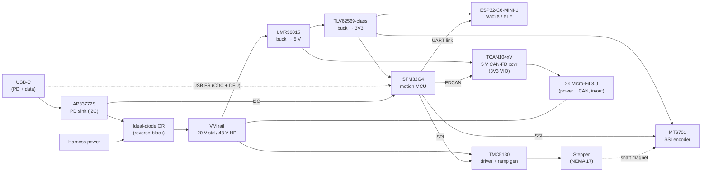

# LockStep — Design Specification

**Status:** Architecture v2 locked, ready for schematic capture
**Last updated:** 2026-08-18
**Supersedes:** v1 (2026-07-05, single ESP32-S3 architecture). Headline changes: split-brain
STM32G4 + ESP32-C6, CAN-FD, AP33772S PD sink, 5 V-supplied CAN transceivers (the 5 V rail
returns), MT6701 encoder, elected-coordinator programming model, HP power entry via
terminal blocks.

---

## 1. Concept

**LockStep** is a modular, closed-loop *smart stepper actuator* node. Each node bolts to
the back of a stepper motor and turns it into an intelligent, addressable actuator that can
be controlled over **USB, CAN-FD, or wireless (WiFi 6 / BLE)** and **daisy-chained** with
other nodes over a single power + CAN cable.

The flagship application is a **6-axis robot arm built entirely from NEMA 17 motors** —
six identical nodes, one per joint. Unlike hobby closed-loop steppers, a LockStep arm is
**programmable like an industrial arm** (Fanuc/KUKA model): motion programs are stored and
executed *on the arm itself* by an elected coordinator node — no PC tether required.

Differentiators vs. existing closed-loop CAN steppers: **USB-C PD power**, **CAN-FD**,
**on-arm program execution**, and a **power-tier-spanning platform** (NEMA 11 → 34) on one
shared firmware, protocol, and connector language.

---

## 2. Node architecture

Split-brain: a deterministic motion MCU plus a wireless co-processor.



**Roles.** The **STM32G4** owns everything real-time and wired: TMC5130 (SPI), encoder
(SSI), CAN-FD, USB (CDC control + ROM DFU flashing), the PD budget (I2C to AP33772S), and
all motion execution. The **ESP32-C6** is a pure wireless peripheral: WiFi/BLE
provisioning, wireless transport, and OTA agent, speaking a framed protocol over UART
(~3 Mbaud with CTS/RTS; SPI pads as fallback). An RF-stack crash can never disturb the
motor loop.

---

## 3. Core components

| Block | Part | Why |
|---|---|---|
| Motion MCU | **STM32G491RET6** (bring-up, LQFP-64) → **STM32G491CET6** (production, LQFP-48) | 170 MHz M4F, FPU + CORDIC, hardware encoder timers, native **FDCAN**, USB FS device + ROM DFU (crystal-less via HSI48+CRS). 512 K flash / 112 K RAM holds motion programs and lookahead buffers — no external NOR. Same die both boards; 64-pin for bring-up probing, 48-pin once the pin map is proven. T7 (105 °C) grade preferred for production if stocked — the board rides a hot motor. |
| Wireless | **ESP32-C6-MINI-1** | WiFi 6 + BLE 5 (+ 802.15.4 for future mesh), pre-certified module, 13.2×16.6 mm, fully isolated from motion. |
| Stepper driver | **TMC5130** (integrated FETs) | Unchanged from v1: internal ramp generator owns step timing; SPI; StealthChop/SpreadCycle; 1.4 A RMS — right-sized for NEMA 17. |
| Feedback | **MT6701**, SSI mode | 14-bit absolute magnetic encoder, fast serial read. (AS5600 dropped — I2C-only is too slow for future high-rate loops.) |
| PD front-end | **AP33772S** | Autonomous negotiation at boot **plus** I2C PDO readback, so firmware knows the granted contract and derates motor current to the brick's real budget. |
| 5 V supply | **LMR36015** buck | 4.2–**60 V** in, 1.5 A — one part covers the 20 V and 48 V tiers. High-frequency variant preferred (see open items). |
| 3V3 supply | **TLV62569 / TPS62A02-class** sync buck | 2 A, >92 % efficient — no LDO dissipation question. Ferrite + local bulk at the C6 for TX bursts. |
| CAN | **TCAN1042V / 1044V-class**, 5 V supply, 3V3 VIO, + ferrite/CMC | FD-rated to 5 Mbps with strong, symmetric differential drive; built-in level shifting via the VIO pin. **Same transceiver on both tiers.** |
| Interconnect (std) | **Molex Micro-Fit 3.0** 43045-0600 ×2 (in/out) | Unchanged from v1: latching, power + CAN in one cable, fits a 42 mm node. |
| Power entry (HP) | **Wago 2604-series PCB blocks / Phoenix MKDS screw blocks** | 32 A-class, 48 V, vibration-tolerant — replaces the v1 Anderson SB idea. |

---

## 4. Power tree

```
USB-C VBUS ──[AP33772S → 5–20 V]──►|──┐   (ideal diode: inject, don't back-feed)
                                      ├──► VM (20 V std / 48 V HP) ──┬──► TMC5130 VS ──► motor
Micro-Fit harness power ◄─────────────┘                              │
                                                                     └──► LMR36015 → 5 V ─┬─► TCAN104xV
                                                                                          └─► TLV62569 → 3V3
                                                                                                ├─► STM32G4, ESP32-C6
                                                                                                └─► MT6701, AP33772S, TMC VCC_IO
```

- **The 5 V rail is back** (v1 had none): the FD transceiver runs from 5 V for drive
  strength and symmetry at FD data rates. 3V3 cascades off it through a second sync buck —
  cascade efficiency ≈ 83 %, fine at these power levels.
- **PD budget policy:** at boot the AP33772S autonomously requests 20 V; the STM32 then
  reads the granted PDO over I2C and sets TMC IRUN from the *actual* wattage. A 65 W brick
  means a slower/weaker arm — never a brownout. In single-brick bench mode the
  **coordinator owns the chain-wide power budget** across all nodes.
- **100 W (20 V / 5 A) is the standard-tier ceiling**, not a guarantee — 5 A requires an
  e-marked cable; a random 65 W brick grants 20 V / 3.25 A.
- **Plain PC USB (5 V) corner case:** the LMR36015 rides ≈100 % duty → ~4.6 V rail; 3V3
  regulates fine; the transceiver sits at its 4.5 V minimum — in-spec but marginal, and
  this mode is bench/flashing-only anyway. Motor cannot run: 5 V is below the TMC5130's
  ~6 V UVLO. Logic-only flash/config off a plain PC port is preserved.
- **Protections (carried from v1):** inrush/soft-start eFuse on harness input, bulk
  electrolytic on VM at the TMC, local bulk on 3V3 for WiFi TX bursts.

---

## 5. Interconnect & CAN-FD bus

- **Connector and pinout unchanged:** Micro-Fit 3.0 6-ckt dual-row 43045-0600, two per
  node (in/out).

  | Pin | 1 | 2 | 3 | 4 | 5 | 6 |
  |---|---|---|---|---|---|---|
  | | +V | +V | GND | GND | CAN_H | CAN_L |

- **Bus: CAN-FD.** Arbitration 500 k–1 Mbps, data phase 2–5 Mbps, 64-byte frames — all six
  joints' setpoints fit in **one frame per sync tick at 1 kHz**.
- **Topology & termination unchanged:** linear multi-drop chain; two 120 Ω terminator
  plugs (Micro-Fit housing, 120 Ω across pins 5–6) in the two unused end jacks, never in
  the middle.

---

## 6. Communication & control

Three transports, **one command set**:

- **USB** — CDC virtual serial on the STM32 for control/config; ROM **DFU** for field
  flashing. Development debug is **SWD** (Tag-Connect) — the S3's USB-Serial-JTAG
  convenience left with the S3.
- **CAN-FD** — the control path inside the arm.
- **WiFi / BLE** — via the C6.

**Gateway feature (now spans both chips):** every node bridges USB↔CAN (STM32) and
WiFi↔UART↔CAN (C6 → STM32), so plugging USB into — or connecting wirelessly to — *any
single joint* reaches the whole chain. No external USB-CAN dongle.

**OTA:** the C6 updates itself over WiFi and pushes STM32 images across the UART link.

---

## 7. Coordination & programming model

All nodes run **identical firmware**. One node — any node, chosen by config initially,
auto-election later — acts as **coordinator**:

- Stores motion programs (Fanuc/KUKA-style: stored routines, not streamed G-code).
- Runs IK, blending, and S-curve interpolation on its G4.
- Streams interpolated setpoints + sync frames over CAN-FD; the other joints track via
  TMC ramp targets.

Programs are uploaded, edited, and jogged over **any transport into any node** — the
gateway forwards to the coordinator.

---

## 8. Ecosystem / power tiers

| Tier | Motor | Driver | Power | Power entry | Signal |
|---|---|---|---|---|---|
| **LockStep** (standard) | NEMA 17 | TMC5130 (integrated) | USB-C PD ≤100 W **or** ~20–24 V DC | Micro-Fit (power + CAN) | Micro-Fit |
| **LockStep HP** | NEMA 23 / 34 | TMC5160 + external FETs | 48 V DC, regen brake clamp | **Wago 2604 / Phoenix MKDS terminal blocks**; Micro-Fit carries CAN only | Micro-Fit |

Same STM32G4 + C6 brain, same CAN-FD protocol, same firmware, same 5 V transceiver. The
60 V-rated LMR36015 front-end drops into both tiers unchanged.

---

## 9. Build order

1. **NEMA 17 bring-up board** — deliberately oversized, G491RET6 (LQFP-64), with test
   points, SWD header, and breakouts. Proves: closed-loop control, the FD bus, the STM32↔C6 link, coordinator
   election, and the PD budget policy.
2. **Productize to 42 mm** NEMA 17 back-mount form factor.
3. **Branch up** → LockStep HP (external FETs, NEMA 23/34, 48 V + regen clamp).
4. **Branch down** → NEMA 11/8. Note: the C6-MINI (13.2×16.6 mm) is far smaller than the
   old WROOM constraint — NEMA 11 may fit the module; NEMA 8 likely needs chip-down or a
   wired-only variant.

---

## 10. Open items

- **LMR36015 switching-frequency variant** — target ~1 MHz-class; confirm the orderable
  fixed-frequency options (believed 400 kHz / 2.1 MHz) at schematic capture and pick.
- Final TCAN part number + 5 Mbps data-phase timing validation.
- AP33772S package/stock check at capture.
- Confirm USB FS device + USB-DFU on STM32G491 in DS/AN2606 at capture (expected present, series-wide).
- 48-pin pin-mux check before the production board drops to G491CET6 (~34 signals vs ~38 usable I/O).
- STM32↔C6 framed-protocol spec.
- Coordinator election protocol (config-ID first, auto-election later).
- Final standard-tier bus voltage (20 vs 24 V).
- HP-tier regen/brake-clamp circuit design.
- Per-joint gear reduction ratios (mechanical).
- IK / trajectory engine details.
- Homing strategy (sensorless vs encoder-index).
